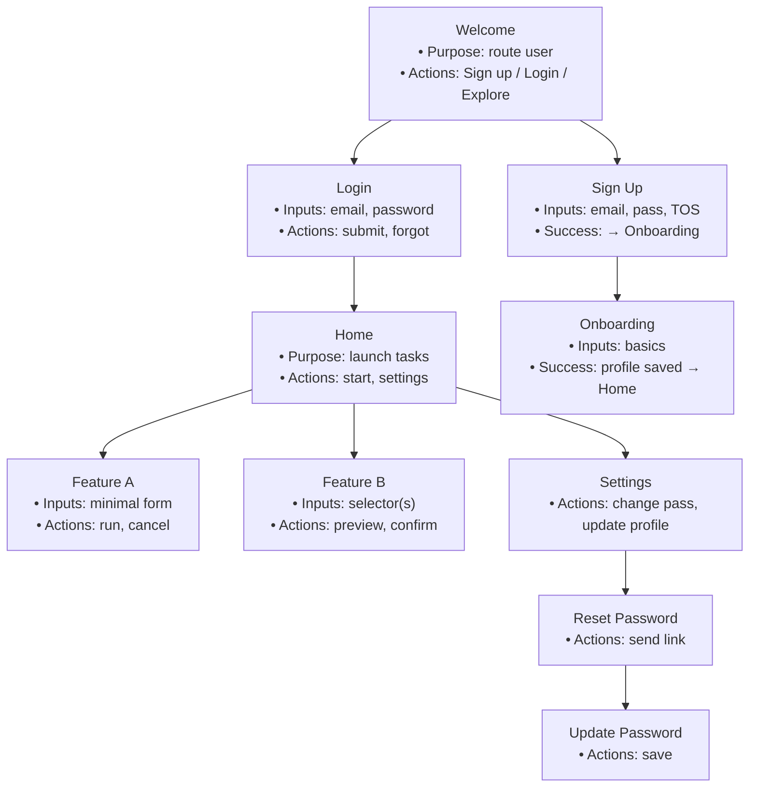
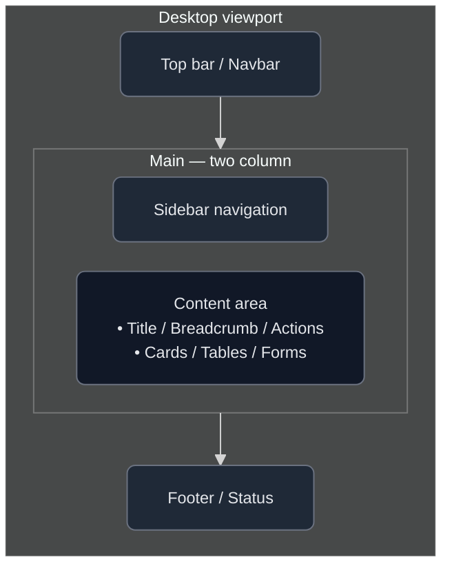
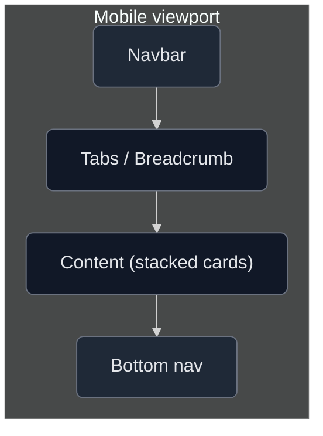
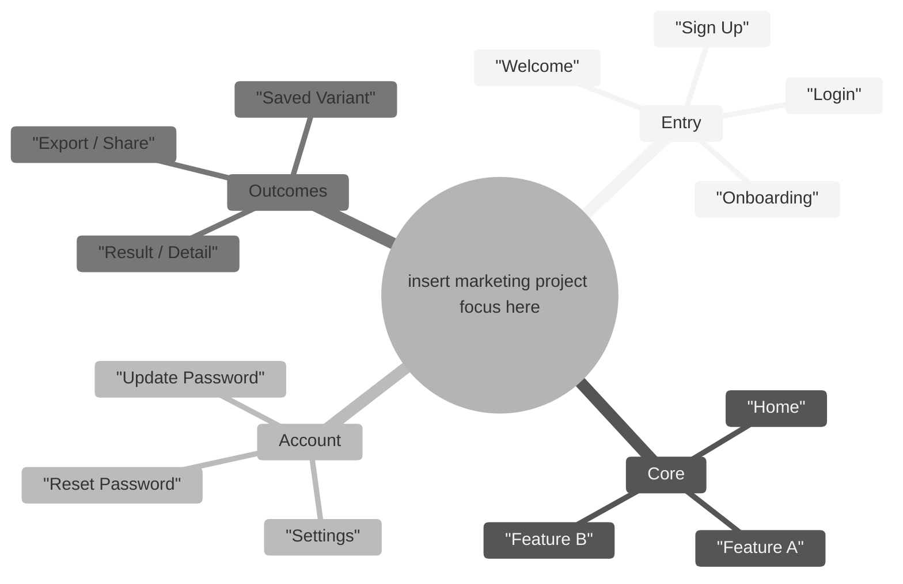
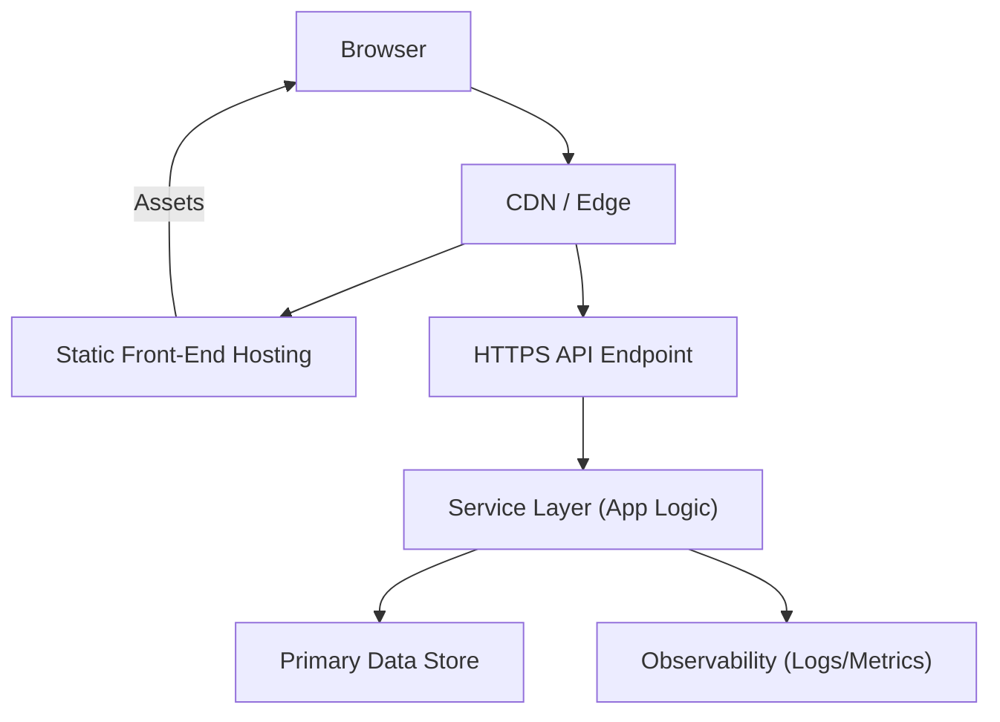
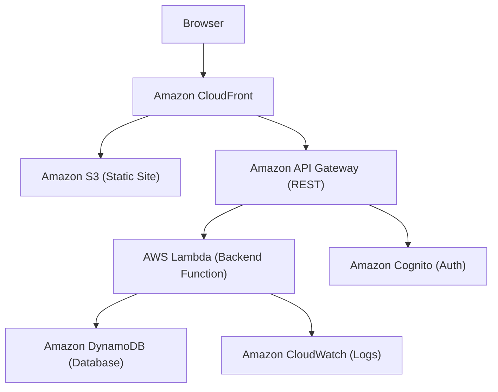

# AI Quad-Tool Workflow — Pain Points to Prototype to Production

*A pipeline for building applications from an idea into a research-backed prototype with a wireframed front end. **GPT-5**, **Notebook LLM**, **Claude (Kiro)**, and **Amazon Q**. This approach includes an MCP bridge to render icon-accurate AWS diagrams.*

> Replace **“insert marketing project focus here”** with your actual campaign, product, or application in all prompts and examples.

---

## What you’ll produce

Following this workflow, you'll end up with the following artifacts and files in your project:

1. **Evidence of real problems and opportunities** – Collected research notes (pain points, workarounds, etc.) in `docs/research_notes.json`.
2. **Complete MVP screen inventory** – A structured list of all screens in the app (with details) in `docs/screens.json`.
3. **Diagrams** (Mermaid format, viewable on GitHub/Kiro):
   - **Wireflow of screens & navigation** → `docs/wireflow.mmd`
   - **Mind map of scope** → `docs/workflows.mmd`
   - **Front-end page wireframe** (accurate, compact layout) → `docs/page_wireframe.mmd`
   - **Portable system architecture** (abstract component diagram) → `docs/architecture.mmd`
4. **Machine-readable specifications** – JSON spec files capturing requirements, design, and tasks (`specs_json/requirements.json`, `specs_json/design.json`, `specs_json/tasks.json`).
5. **Deterministic front-end scaffold** – Auto-generated front-end code scaffold (routes and one JSON file per screen) with execution logs (`.kiro/logs/`).
6. **AWS icon architecture diagram** – A rendered AWS architecture diagram (with official icons via MCP) in `docs/architecture.aws.svg`.
7. **Infrastructure-as-Code stubs** – Amazon Q–assisted review and starter IaC (SAM or CDK templates) in the `/infra` directory.

## Tools and Clear Contracts

This workflow uses a quartet of specialized tools, each with a clearly defined responsibility. By dividing the work, we ensure each step outputs a specific artifact (JSON files, diagrams, code, etc.) that the next tool can use directly. Here’s how each tool contributes:

| Tool                      | Responsibility                                       | Primary Outputs                                                  |
| ------------------------- | ----------------------------------------------------- | ---------------------------------------------------------------- |
| **GPT-5**                 | Research, screen inventory, and formal spec creation  | `docs/research_notes.json`, `docs/screens.json`, `specs_json/*`  |
| **Notebook LLM**          | Generating visual maps & wireframes from structured inputs and consolidated documents | `docs/wireflow.mmd`, `docs/workflows.mmd`, `docs/page_wireframe.mmd` |
| **Claude (Kiro)**         | Deterministic execution of tasks to scaffold the app (code generation) | `/src` routes & components, `/src/screens/*.json`, `.kiro/logs/` |
| **Amazon Q (Developer)**  | Cloud architecture advice, IaC stub generation, and repo review | IaC snippets (AWS SAM/CDK templates), architecture notes         |
| **AWS Diagram MCP server** | Rendering AWS icon-accurate diagrams from an architecture spec JSON | `docs/architecture.aws.svg`                                       |

**Why this split?** By capturing the project’s intent first as **JSON documents and diagrams**, we make the implementation step straightforward. Every decision (features in scope, screen flow, architecture design) is recorded before coding. This means the build tool (Claude) isn’t making guesses – it’s following a script. The result is a transparent, auditable process where you can trace every piece of code back to a decision in the specs or diagrams.

## Repository Baseline (Kiro-friendly)

Before diving into the steps, ensure your project repository is structured to accommodate all these outputs. Here’s an example layout (for a Kiro-enabled project) that we'll be populating throughout the workflow:

```plaintext
/  (root)
├── .kiro/
│   ├── prompts/
│   ├── specs/<feature>/{requirements.md, design.md, tasks.md}
│   └── logs/
├── docs/
│   ├── wireflow.mmd          # Mermaid wireflow diagram
│   ├── workflows.mmd         # Mermaid mind map of workflows
│   ├── page_wireframe.mmd    # Mermaid page wireframe (layout)
│   ├── architecture.mmd      # Portable (generic) system architecture diagram
│   ├── architecture.spec.json# Source spec for AWS diagram generation
│   └── architecture.aws.svg  # Rendered AWS architecture diagram (from MCP)
├── specs_json/
│   ├── requirements.json
│   ├── design.json
│   └── tasks.json
├── infra/
│   └── template.yaml         # IaC stub (e.g. AWS SAM or CDK template)
└── src/
    ├── components/ScreenCard.jsx
    ├── screens/              # one JSON file per screen (title + bullets)
    └── routes/               # front-end route definitions (per screen)
```

In this structure:
- **.kiro/** contains orchestrator configs, prompts, spec templates, and logs for the Claude (Kiro) runs.
- **docs/** holds all documentation outputs: diagrams (Mermaid and rendered SVG), and the architecture spec.
- **specs_json/** holds the structured specification files that define requirements, design, and task breakdown.
- **infra/** is for infrastructure-as-code (initially a stub template, to be expanded).
- **src/** contains the application source code: the component(s) for displaying screens, the JSON files defining each screen’s content, and the routing setup.

---

## Step 0 — Charter & Guardrails (GPT-5)

**Purpose.** (Deep Research Mode) Define a clear project charter and guardrails before any development. Fix your scope before it balloons – as an experienced engineer knows, small MVPs ship while vague projects don’t. This step uses GPT-5 to nail down what’s in scope and out of scope for the first iteration.

**Prompt to GPT-5**  
``` 
Constrain the MVP for "insert marketing project focus here". Return JSON:
- in_scope (3–6 items)
- out_of_scope (3–6 items)
- personas (about 2 key user types)
- time_horizon (target timeline, e.g. 1–2 sprints)
- success_criteria (3–5 observable outcomes)
```

**Deliverable.** Save the output as `docs/charter.json`.

**Acceptance.** After this step, another engineer or stakeholder should be able to read `docs/charter.json` and clearly decide if a given feature idea is within the defined scope or not.

---

## Step 1 — Evidence-Driven Research (GPT-5)

**Purpose.** (Deep Research Mode) Ground your project in real user needs and pain points instead of assumptions. In this step, GPT-5 acts as a senior research analyst: it will enumerate concrete user pain points related to *“insert marketing project focus here”*, identify how users currently work around these issues (and why those workarounds fall short), and suggest potential solution ideas for each pain.

**Prompt to GPT-5**  
```
Act as a senior research analyst. For "insert marketing project focus here":
- List 6–10 concrete user pain points (observable behaviors or frustrations).
- For each pain point: describe current workarounds users try, and why those approaches fail or are insufficient.
- Then for each pain point: suggest 2–3 possible solution angles. For each angle, give an "idea" description, an "opportunity" score (1–10), a "feasibility" score (1–10), and a one-line "why" explanation.
Output a JSON array of objects with the structure:
{
  pain_point: "...",
  workarounds: ["..."],
  limits: ["..."],
  solution_angles: [
    { idea: "...", opportunity: X, feasibility: Y, why: "..." },
    ...
  ]
}
```

**Deliverable.** Save this analysis as `docs/research_notes.json`.

**Acceptance.** Each listed pain point should be something tangible and observable (think of something you could capture on video or in user interviews). Avoid abstract slogans – the JSON should describe real behaviors or problems. Each pain point entry should clearly show why existing solutions aren't enough and why your project idea has a promising angle.

---

## Step 2 — Screen Inventory (GPT-5)

**Purpose.** Decide on every screen the MVP will include *before* drawing any UI. By listing out the screens and their details now, we ensure completeness and prevent scope creep later. GPT-5 will derive a minimal but complete set of application screens based on the project focus.

**Prompt to GPT-5**  
```
Derive a minimal but complete set of screens for "insert marketing project focus here".
For each screen, provide:
- short_title
- short_purpose (one line describing the screen’s role)
- primary_inputs (2–5 key inputs on the screen, if any)
- primary_actions (2–5 main actions the user can take)
- success_criteria (2–4 observable outcomes for this screen)
- edge_cases (2–4 things that could go wrong or are unusual scenarios)
Return the result as a JSON array.
```

**Deliverable.** Save the screen list as `docs/screens.json`.

**Acceptance.** The set of screens should cover the entire user journey for the MVP without overlaps. If a single screen description has more than roughly 6 bullet points of inputs/actions, consider splitting that into multiple screens (e.g., a list view vs. a detail view). Each screen entry should be concise. For example, a “List” screen might show a summary of items, and a separate “Detail” screen shows a single item’s full info.

---

## Step 3 — Wireflow Diagram (Notebook LLM → Mermaid)

**Purpose.** Visualize how all the screens connect and what each screen generally contains. Here we create a **wireflow** (a flow diagram of UI screens) using Mermaid syntax, which shows each screen as a node (with a brief summary) and arrows indicating navigation between screens. This helps validate the user flow and catch any missing screens or navigation issues early.

**Instruction to Notebook LLM**  
```
From docs/screens.json, generate a Mermaid flowchart that depicts the wireflow of the application. Each node should be labeled with the screen title and a few bullet points (3–6) of key information or actions, using `<br/>` for line breaks within the node.
Use clear arrow connections to show typical navigation paths between screens. For any label that includes punctuation or spaces, wrap it in quotes to avoid Mermaid syntax issues.
Export the diagram to docs/wireflow.mmd.
```

**Starter Example (Mermaid):**


*(The above is a sample to illustrate the format. Your actual screens and connections will differ.)*

---

## Step 3b — Front-End Page Wireframe (Notebook LLM → Mermaid)

**Purpose.** Design a page layout wireframe that shows the general structure of a typical app page (without specific content). This ensures everyone understands how the main regions of the UI (header, sidebar, content area, footer) will be arranged. The idea is to create a schematic that looks like a real app window layout, so developers can agree on the basic frame before any detailed UI design. We will generate this as a Mermaid diagram as well.

**Goal:** Create a **page-accurate shell** of the application’s UI. It should illustrate a standard page template with a top navigation/header, a main section with a left sidebar and a content area, and a bottom footer. We want this in Mermaid format, styled compactly so it’s easy to view in documentation.

### Inputs
- The list of screens from `docs/screens.json` (to remind us what content needs to fit).
- Knowledge of a typical web app layout (common pattern: a header bar, a left navigation panel, main content area, and footer).

### Output
- A Mermaid diagram saved as `docs/page_wireframe.mmd` representing the layout structure.

### Success Criteria (Acceptance)
- The diagram clearly shows a header at the top, a main section with two columns (sidebar and content), and a footer at the bottom.
- The nodes for Header, Sidebar, Content, Footer are connected in one vertical chain (Header → Main → Footer) to enforce that vertical stacking in the diagram.
- Inside the "Main" subgraph, the Sidebar and Content nodes are laid out side-by-side (left-right direction).
- The Mermaid code should be optimized for compactness (so it doesn’t render too large) – e.g. reducing default spacing and font size.
- The wireframe should focus on structure, not actual UI elements, so it should use generic labels (like "Cards / Tables / Forms" for content).
- No extraneous or deeply nested Mermaid elements that would complicate the diagram (keep it simple and readable).

### Anti-patterns (reject these)
- **Orphaned nodes:** e.g., Header or Sidebar not linked into the flow. Every element should be connected (no floating boxes).
- **Empty subgraphs:** Don’t create a subgraph with an empty title or no content.
- **Misplaced direction tags:** Don’t put `direction LR` on the same line as a `subgraph` declaration (Mermaid will mis-parse it).
- **Overly detailed UI mockup:** This is a high-level wireframe of regions, not a pixel-perfect design. Avoid adding dozens of fine-grained elements.

**Instruction to Notebook LLM**  
```
Create a Mermaid flowchart diagram for a generic page layout:
- It should have a Header at the top, a Footer at the bottom, and a Main section in between.
- Inside the Main, include two blocks: a Sidebar (on the left) and a Content area (on the right).
- Ensure the flowchart uses a top-down direction for the overall page (Header over Main over Footer), and left-right direction inside the Main subgraph.
- Include a Mermaid init block to set a dark theme, small font, and small spacing for compactness.
- Output the diagram to docs/page_wireframe.mmd.
```

**Validated Desktop Layout Diagram (Mermaid):**


*(Above: A sample Mermaid wireframe with a desktop-style layout. It shows the general structure – header (H), main section (with sidebar SB and content CT), and footer (F).)*

**Optional Mobile Layout Variant:**


*(Above: An optional mobile layout variant for reference. It uses a stacked layout: mobile header (MH), maybe a secondary menu (MT), content (MC) and a bottom navigation bar (MB).)*

### Bridge to Code (Turning Wireframes into Components)

Once the wireframes are done, we know what *regions* each page will have. We can now plan our React components and routing. The idea is to have each screen’s content defined in a JSON file (for easy editing and consistency), and a generic React component that reads that JSON and displays the screen.

For example, define each screen in `/src/screens` as a JSON file with a title and bullet points:

```json
{
  "title": "Home",
  "bullets": [
    "Shows key stats and quick actions",
    "Links to Feature A and Feature B",
    "Recent items are listed in a table"
  ]
}
```

And create a React component (ScreenCard) that can load this JSON and render it:

```jsx
import { useEffect, useState } from "react";

export default function ScreenCard({ screen }) {
  const [data, setData] = useState({ title: "", bullets: [] });

  useEffect(() => {
    import(`../screens/${screen}.json`).then(mod => setData(mod));
  }, [screen]);

  return (
    <section className="max-w-4xl mx-auto p-6 bg-gray-900/60 rounded-2xl shadow">
      <h1 className="text-xl font-semibold mb-3">{data.title}</h1>
      <ul className="list-disc pl-6 space-y-1">
        {data.bullets.map((b, i) => <li key={i}>{b}</li>)}
      </ul>
    </section>
  );
}
```

**Routing Tip:** Set up one React Route per screen identified in the wireflow. Each route can render a `<ScreenCard screen="ScreenName" />` corresponding to one of the JSON files (e.g., Home, FeatureA, FeatureB, etc.). This way, the Mermaid wireflow (Step 3) tells you **how pages connect**, and the page wireframe (Step 3b) tells you **what goes into each page structure**. Together, they guide the implementation of your front-end without ambiguity.

---

## Step 4 — Mind Map of Screens (Notebook LLM → Mermaid)

**Purpose.** Provide a high-level overview of the application screens and how they group into sections or categories. This mind map will let stakeholders quickly see all the pieces of the app in one view (for example, which screens are for onboarding, which are core features, etc.).

**Instruction to Notebook LLM**  
```
From docs/screens.json and docs/wireflow.mmd, generate a Mermaid mindmap diagram grouping the screens into logical categories:
- Use top-level nodes such as Entry, Core, Account, Outcomes (adjust as needed for the project).
- Under each group, list the relevant screen names as sub-nodes. 
- Remember to wrap any screen names containing spaces or special characters in quotes.
Export the mind map to docs/workflows.mmd.
```

**Template (Mermaid mindmap):**


*(In the above example, replace the placeholder root and screen names with the actual project focus and screens from your app. The categories can be adjusted depending on how your screens naturally group together.)*

---

## Step 5 — Formal Specifications (GPT-5)

**Purpose.** Translate the agreed-upon features and design into formal, machine-readable specifications. Here GPT-5 will produce JSON files for requirements, design, and tasks. These specs are the single source of truth that developers (or an AI like Claude) will follow to implement the system.

**Prompt to GPT-5**  
```
Using docs/wireflow.mmd and docs/workflows.mmd as references for "insert marketing project focus here", produce three JSON specification files:

1. **specs_json/requirements.json** – Should include sections like goals (what we aim to achieve), non_goals (explicitly what we are not doing), acceptance_criteria (how to know the project succeeds), constraints (technical or business constraints), and dependencies (external or prior requirements).

2. **specs_json/design.json** – Outline the system design, including front-end architecture, backend/services, data storage, security considerations, observability (logging/monitoring), and deployment approach. Also list key interfaces or APIs, and any specific UI views (with reference to screens).

3. **specs_json/tasks.json** – Provide a breakdown of implementation tasks. Each task should have a unique ID, a title, and optionally fields like depends_on (other task IDs), and expected artifacts or deliverables. Ensure tasks are small, achievable units of work. (Think of each as a step a developer can complete in a few hours to a day.)

Return each of the above as separate JSON outputs.
```

**Deliverable.** Three JSON files in the `specs_json/` folder: `requirements.json`, `design.json`, and `tasks.json`.

**Acceptance.** Validate that the JSON is properly structured (you can run `jq . specs_json/*.json` to check for syntax). The content should accurately reflect the earlier steps: e.g., requirements.json should align with the charter (Step 0) and user pains (Step 1); design.json should cover all components shown in the architecture diagram and wireframes; tasks.json should cover building all screens, components, and infrastructure pieces identified (no missing parts). Each JSON should be coherent and understandable to another engineer.

---

## Step 6 — Deterministic Scaffold Generation (Claude in Kiro)

**Purpose.** Now that we have all the designs and specs, we use Claude (through the Kiro automation environment) to generate the actual code scaffold for the front-end. This step is about translating the wireflow and specs directly into code: setting up the project, adding routes for each screen, creating stub components, and so on. We call it *deterministic* because Claude will strictly follow the plan laid out in the specs/diagrams without improvising.

**Prompt to Claude (in Kiro)**  
```
Create a front-end scaffold that exactly matches the screens and navigation in docs/wireflow.mmd:
- Use React (with Vite) and Tailwind CSS for styling.
- Implement one React route per screen node in the wireflow.
- Include a navigation page (or menu) that lists all screens for easy access during testing.
- Implement a shared <ScreenCard> component (as outlined in Step 3b) that reads from /src/screens/<ScreenName>.json and displays the title and bullet points.
- Generate a JSON file in /src/screens/ for each screen identified (with placeholder bullets if not provided).
- Ensure there are no missing routes or screens (the app should not have any 404 for the planned screens).
- Log all actions to .kiro/logs/ for transparency.
Stop if any screen from the wireflow diagram does not have a corresponding route or JSON file.
```

*(In Kiro, the above prompt can be broken down into tasks if needed. For example: initialize project, create routes, add ScreenCard component, etc., each with acceptance criteria. The goal is to have a running app skeleton that reflects the flow chart.)*

**Optional – Structured Task File:** Instead of a single prompt, you might use a tasks JSON to guide Claude step-by-step. For example, a `specs_json/tasks.json` entry (or a separate `.kiro` tasks file) might look like:

```json
{
  "tasks": [
    {
      "id": "T-001",
      "title": "Initialize project and Tailwind setup",
      "run": [
        "npm create vite@latest app -- --template react",
        "cd app && npm install",
        "npm install -D tailwindcss postcss autoprefixer",
        "npx tailwindcss init -p"
      ],
      "acceptance": [
        "package.json exists",
        "tailwind.config.js exists"
      ]
    },
    {
      "id": "T-002",
      "title": "Create routes for all screens and a Nav page",
      "depends_on": ["T-001"],
      "acceptance": [
        "All defined screens have a route in the app",
        "A Nav page lists links to all screens",
        "No screen navigation results in a 404"
      ]
    },
    {
      "id": "T-003",
      "title": "Implement ScreenCard component and screen JSON files",
      "depends_on": ["T-002"],
      "acceptance": [
        "Each route renders a ScreenCard with the correct title and bullet points",
        "Each screen has a corresponding .json file with placeholder content"
      ]
    }
  ]
}
```

*(The above is an illustration of how you could break down the scaffold tasks. Claude (Kiro) can execute this plan deterministically. Once this step is done, you should have a basic front-end application structure ready.)*

---

## Step 7 — Portable System Architecture Diagram ()

**Purpose.** Draft a high-level system architecture before tying it to specific cloud services. This diagram outlines the major pieces of the system (browser, CDNs, APIs, databases, etc.) in a neutral way. It serves as a sanity check that all the necessary components are identified and in the right order, before we implement them on AWS.

Using Mermaid, we can sketch a simple directed graph of the system:



*(This shows a generic flow: the user’s browser hits a CDN for front-end assets and API calls, which go to an API gateway, then to a service (app backend), which talks to a database and also sends logs/metrics to an observability service. This is not AWS-specific yet, but sets the stage for mapping to AWS in the next step.)*

---

## Step 8 — AWS Architecture Diagram via MCP

**Purpose.** Now we map the portable architecture to actual AWS services and create a detailed architecture diagram with official AWS icons. We’ll use an **MCP (Mermaid Charting Processor)** server specialized for AWS diagrams to generate this automatically from a spec file.

**8.1 Architecture Spec (JSON)** – First, define the mapping in a JSON spec file (`docs/architecture.spec.json`). This file will list the AWS services for each part of the system:

```json
{
  "title": "insert marketing project focus here - v1",
  "region": "us-east-1",
  "frontend": { "cdn": "Amazon CloudFront", "hosting": "Amazon S3 (Website)" },
  "identity": { "auth": "Amazon Cognito" },
  "api": { "gateway": "Amazon API Gateway (REST)" },
  "compute": { "primary": "AWS Lambda" },
  "data": { "primary": "Amazon DynamoDB", "assets": "Amazon S3" },
  "observability": ["Amazon CloudWatch", "AWS X-Ray"],
  "notes": ["Static website served via S3 and CloudFront", "Cognito for user auth and JWTs", "API Gateway fronting Lambda business logic"]
}
```

**8.2 Kiro MCP Configuration** – Ensure your Kiro (or whichever environment) knows about the AWS diagram MCP. For example, in `.kiro/mcp.json` you might have:

```json
{
  "mcpServers": {
    "aws-diagrams": {
      "command": "docker",
      "args": [
        "run", "--rm", "-p", "3333:3333",
        "ghcr.io/example/aws-diagrams-mcp:latest"
      ],
      "env": { "AWS_REGION": "us-east-1" }
    }
  }
}
```

(This configuration means there's an MCP server named "aws-diagrams" that runs a Docker container capable of producing AWS diagrams. Adjust the image and port as needed for your setup.)

**8.3 Prompt the MCP** – Now, instruct the MCP to generate the diagram. In your Kiro interface or CLI, you might issue:

```
Use server "aws-diagrams".
Read docs/architecture.spec.json.
Render an AWS architecture diagram (dark theme with official AWS icons) and save it as docs/architecture.aws.svg.
Return a short text legend mapping each service to its icon.
```

After running this, you should get `docs/architecture.aws.svg` generated, and the MCP might also provide a legend (which could be captured in logs or console output). Open the SVG to verify it matches your expectations (e.g., CloudFront icon connected to S3 and API Gateway, etc., per the spec).

---

## Step 9 — Review and IaC Generation with Amazon Q

**Purpose.** Leverage Amazon Q (AWS’s AI developer assistant) to review the architecture and generate starter Infrastructure-as-Code. At this stage, we have the architecture diagram and spec; Amazon Q can validate if anything is missing (like auth, error handling, etc.) and then scaffold a template for our cloud resources.

*Setup:* Open your project in VS Code (with the Amazon Q extension installed). Ensure you're authenticated with AWS and have the repository open.

**Review Prompt to Amazon Q:** Ask Q to analyze the architecture and specs for completeness:
```
Please review docs/architecture.mmd and docs/architecture.aws.svg, along with the JSON specs in specs_json/*.json.
Identify any missing components or concerns (e.g., authentication flows, logging, error handling, rate limiting).
Propose a minimal AWS reference architecture that aligns with our wireflow and specs, and list the AWS services and how they connect.
```

Amazon Q should respond with insights or recommendations if something obvious is missing or could be improved in the architecture.

**IaC Prompt to Amazon Q (AWS SAM template):** Now ask Q to generate an Infrastructure-as-Code skeleton, for example using AWS SAM:
```
Generate a starter AWS SAM template for this architecture.
It should include:
- A CloudFront distribution for the static front-end (with an S3 bucket for website hosting).
- An Amazon API Gateway (REST) integrated with AWS Lambda for the backend.
- An Amazon DynamoDB table (with a primary key and sort key) for data storage.
- An Amazon Cognito User Pool for authentication (with a hosted UI if appropriate).
- Logging and tracing via Amazon CloudWatch Logs and AWS X-Ray.
Include necessary IAM roles/permissions.
Use "us-east-1" as the default region.
Add TODO comments for any configuration details that need to be filled in.
```

Amazon Q will then produce a YAML (or CDK code) outline. For example, a simplified SAM template could look like:

```yaml
AWSTemplateFormatVersion: '2010-09-09'
Transform: AWS::Serverless-2016-10-31
Description: insert marketing project focus here - v1 (Infrastructure)
Globals:
  Function:
    Runtime: nodejs18.x
    Tracing: Active
Resources:
  WebsiteBucket:
    Type: AWS::S3::Bucket
    Properties:
      WebsiteConfiguration:
        IndexDocument: index.html
  CloudFrontDistribution:
    Type: AWS::CloudFront::Distribution
    Properties: 
      # ... (distribution config pointing to the S3 bucket) ...
  ApiGateway:
    Type: AWS::Serverless::Api
    Properties:
      StageName: prod
  BackendFunction:
    Type: AWS::Serverless::Function
    Properties:
      CodeUri: src/backend/
      Handler: index.handler
      Runtime: nodejs18.x
      Events:
        Api:
          Type: Api
          Properties:
            RestApiId: !Ref ApiGateway
            Path: /{proxy+}
            Method: ANY
  DataTable:
    Type: AWS::DynamoDB::Table
    Properties:
      BillingMode: PAY_PER_REQUEST
      KeySchema:
        - AttributeName: pk
          KeyType: HASH
        - AttributeName: sk
          KeyType: RANGE
      AttributeDefinitions:
        - AttributeName: pk
          AttributeType: S
        - AttributeName: sk
          AttributeType: S
  UserPool:
    Type: AWS::Cognito::UserPool
    Properties:
      # ... Cognito user pool settings ...
Outputs:
  CloudFrontURL:
    Value: !GetAtt CloudFrontDistribution.DomainName
  ApiEndpoint:
    Value: !Sub "https://${ApiGateway}.execute-api.${AWS::Region}.amazonaws.com/prod/"
```

*(The above is an abbreviated example. Amazon Q will generate a complete template with more detail. Review the template for any placeholders or TODOs and fill them in. You can use `sam validate` or `sam deploy --guided` to further validate and deploy when ready.)*

---

## Step 10 — Verification and Iteration

**Purpose.** Finally, verify that every artifact is consistent and nothing was missed. This is a loopback step – you might iterate through previous steps if something doesn’t line up.

Go through these checks (and fix as needed):

- **Diagrams in sync:** Open each Mermaid diagram (`docs/wireflow.mmd`, `docs/workflows.mmd`, `docs/page_wireframe.mmd`, `docs/architecture.mmd`) in a Mermaid viewer (or via the GitHub preview if available) to ensure they render correctly and reflect the intended design. If any diagram looks wrong or is unreadable, go back and correct it.
- **AWS Diagram generated:** Ensure the AWS architecture SVG (`docs/architecture.aws.svg`) was created by the MCP and accurately represents the architecture (compare it with the Mermaid architecture diagram and spec). All key services should appear and be connected properly.
- **Specs are valid JSON:** Run `jq . specs_json/*.json` (or open the files in a JSON linter) to confirm there are no syntax errors. The content should make sense relative to earlier steps.
- **Front-end completeness:** Check that for every screen node in the wireflow (every screen listed in `docs/screens.json`), there is a corresponding route in the front-end code and a JSON file in `src/screens/`. Navigate through the running app (if you start the dev server) to verify no route is missing.
- **Infrastructure completeness:** Have Amazon Q or an AWS expert review the final architecture and IaC. Run `sam validate` (for SAM templates) or `cdk synth` (for CDK) to ensure the infrastructure definitions have no errors. All resources drawn in the architecture diagram should be represented in the IaC template.
- **Logs and automation checks:** Review the `.kiro/logs/` files to see the output from the automated steps (Claude's actions, etc.). These logs should show each planned action being executed and succeeding. If something failed or was skipped in the automation, address it and rerun that step.

This verification step is crucial. It ensures that the journey from **pain points** (Step 1) to **prototype to production** has no gaps. If everything looks good, you have a solid foundation: clear documentation, a prototype front-end, and an initial cloud setup ready to evolve into a production system.

---

## Prompt Library (Summary of Commands)

For convenience, here is a summary of the prompts and instructions used in each step of this workflow:

- **MVP Scope Definition (GPT-5):** *“Constrain the MVP for [project]. Return JSON with in_scope, out_of_scope, personas, time_horizon, success_criteria.”* → (Produces `docs/charter.json`)
- **User Research (GPT-5):** *“List 6–10 user pain points for [project], with workarounds and solution angles (opportunity, feasibility)… output JSON.”* → (`docs/research_notes.json`)
- **Screen List (GPT-5):** *“Derive a minimal set of screens for [project] with title, purpose, inputs, actions, success_criteria, edge_cases… JSON.”* → (`docs/screens.json`)
- **Wireflow Diagram (Notebook LLM):** *Generate Mermaid flowchart from screens.json showing navigation.* → (`docs/wireflow.mmd`)
- **Page Layout Wireframe (Notebook LLM):** *Generate Mermaid diagram of page layout (header, sidebar, content, footer).* → (`docs/page_wireframe.mmd`)
- **Mind Map (Notebook LLM):** *Generate Mermaid mindmap grouping screens (Entry, Core, etc).* → (`docs/workflows.mmd`)
- **Specs Generation (GPT-5):** *Produce requirements.json, design.json, tasks.json based on diagrams.* → (`specs_json/*.json`)
- **Code Scaffold (Claude/Kiro):** *Create React+Vite project, one route per screen, ScreenCard component, etc.* (logs in `.kiro/logs/`, code in `src/`)
- **AWS Diagram (MCP):** *Read architecture.spec.json and render AWS diagram to architecture.aws.svg.*
- **AWS Review & IaC (Amazon Q):** *Review architecture, generate SAM/CDK template for CloudFront, S3, API Gateway, Lambda, DynamoDB, Cognito, etc.* → (`infra/template.yaml`)

---

## Appendix – Example AWS Architecture in Mermaid

For completeness, here is a Mermaid diagram that maps our system architecture to specific AWS services (using official names). This is conceptually similar to what the MCP generates, but in Mermaid text form:



*(This shows the user accessing the app through CloudFront, which serves content from S3 and routes API requests to API Gateway. API Gateway invokes a Lambda, which interacts with DynamoDB. Cognito handles user authentication (perhaps via JWT tokens passed to API Gateway). Lambda sends logs to CloudWatch for monitoring.)*
